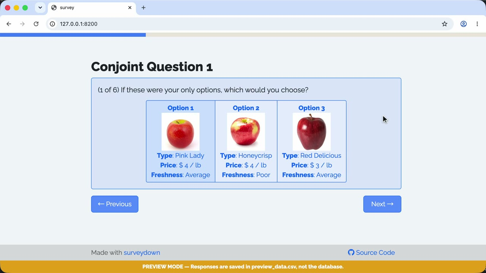

A conjoint survey template with options shown in buttons.

### 🟢 Demo

Try the live survey: https://surveydown-conjoint-buttons.hf.space

### 🎬 Walkthrough Recording

[](https://github.com/surveydown-dev/template_conjoint_buttons/blob/main/video-recording.mp4)

*Click the image above to play the recording.*

### Template page

https://surveydown.org/templates/conjoint_buttons

### Create this template

Run this command in your R console:

```r
surveydown::sd_create_survey(
  #path = "path/to/survey",
  template = "conjoint_buttons"
)
```

### Documentation

[Start with a template](https://surveydown.org/docs/getting-started#start-with-a-template)
